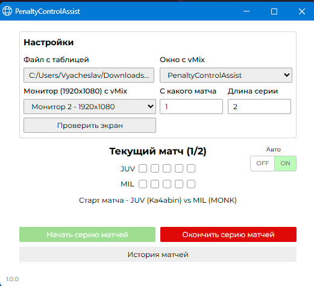
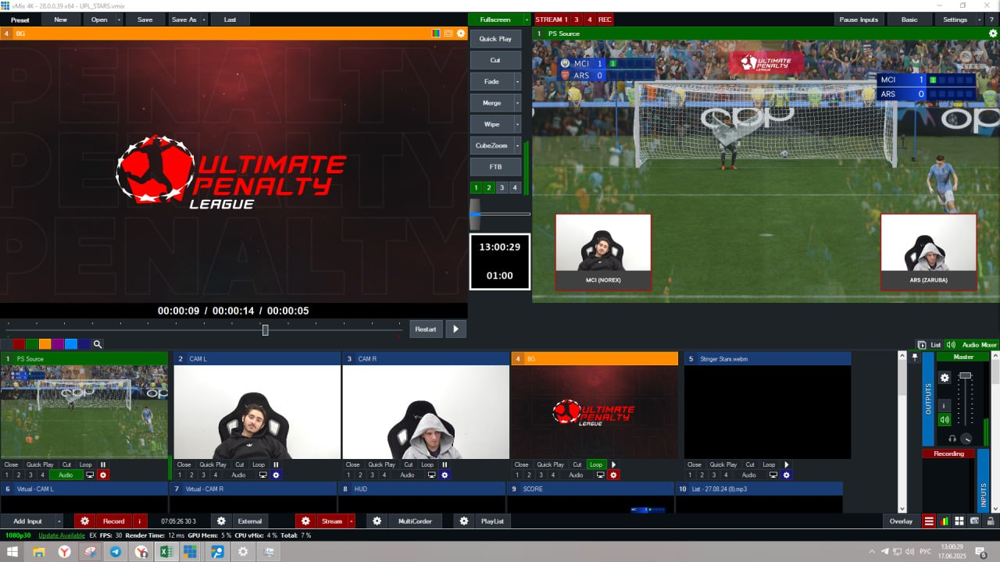
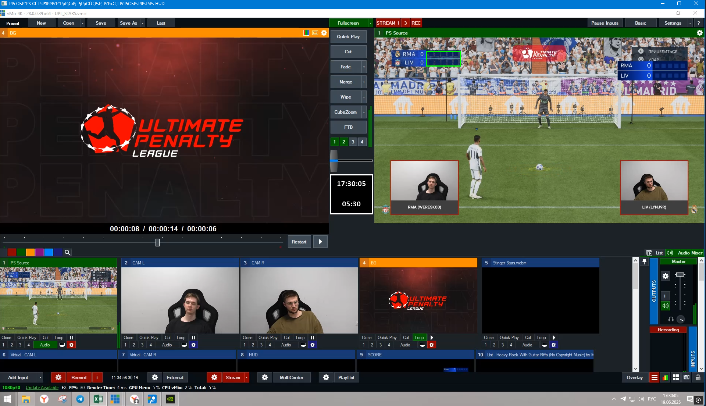
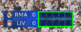
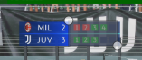

# PenaltyControlAssist
## Введение
Приложение позволяет автоматизировать работу режиссеров, работающих в vMix.

### Основные функции:
1) Автоматическое отслеживание результатов ударов на экране
2) Управление состоянием серии матчей (определение условий окончания матчей или серий)
3) Запись результатов в реальном времени в выбранный файл .xlsx
4) Логирование результатов матчей в текстовом формате. Также можно открыть историю матчей во время серии;
5) Автоматическая отправка нажатий клавиш в vMix (запуск событий);
6) Ручной режим ввода для экстренных ситуаций.

На данный момент приложение успешно распознает результаты в течение 2с в **~99%** случаев. При этом ложных срабатываний замечено не было. Никакие красные/зеленые картинки, которые могут попадаться на экране не вызывают ложно-истинное определение.

### Как это работает?
После начала серии матчей приложение начинает анализировать каждый кадр выбранного монитора. При обнаружении в определенной области экрана, где программа ожидает видеть внутриигровой HUD, квадрата с длиной 12-14px и такой же шириной, если его цвет близок к зеленому или красному, то соответствующий результат записывается. 

Отслеживание результатов прекращается только при остановке серии матчей или отключении автоматического режима в приложении. Между матчами изображение продолжает анализироваться для более гибкой работы. Так, режиссеру не нужно запускать каждый следующий в серии матч вручную.

## Оглавление
### [1. Установка](#установка)
### [2. Конфигурация](#конфигурация)
### [3. Описание проекта](#desc)
### [4. Алгоритм работы](#algo)
### [5. FAQ](#FAQ)
## [Документация для разработки](docs/code.md)

## Установка

<details>
    <summary>Разработчику</summary>

Чтобы запустить проект необходимо иметь установленный Python 3.
1) Клонируем проект
2) Создаем и активируем виртуальное окружение ``venv\Scripts\activate``
3) Устанавливаем зависимости ``pip install -r requirements.txt``

Для запуска ``python main.py``

Для создания продакшен билда ``python build.py``. Это создаст в папке dist .exe файл, который можно будет запускать и без установки Python на компьютере
пользователя.
</details>

<details open>
    <summary>Пользователю</summary>

Необходимо просто запустить .exe файл, который вам передаст разработчик. Также .exe файл можно найти в папке dist этого репозитория.

После этого нужно 
1) выбрать файл с таблицей;
2) монитор 1920х1080, в котором находится vMix; 
> Проверить какой монитор выбран и где программа ожидает видеть HUD можно нажав на кнопку "Проверить экран"),
3) Выбрать окно с vMix для отправки в него нажатий клавиш после каждого удара.
</details>

## Конфигурация

Конфигурация находится в ``config.json`` файле, который обычно лежит в той же папке, что и проект/.exe файл.

| Параметр               | Тип данных        | Описание                                                                                    | Значение по умолчанию                                                                      |
|------------------------|-------------------|---------------------------------------------------------------------------------------------|--------------------------------------------------------------------------------------------|
| `hud_coords`           | tuple[Point, Point] | Координаты области HUD (верхний левый и нижний правый углы)                                 | `({'x': 1163, 'y': 114}, {'x': 1256, 'y': 154})`                                           |
| `max_kicks`            | int               | Максимальное количество ударов/голов в матче                                                | `5`                                                                                        |
| `fps`                  | int               | Частота анализа кадров в секунду                                                            | `30`                                                                                       |
| `matches_in_series`    | int               | Количество матчей в серии                                                                   | `6`                                                                                        |
| `file_path`            | str               | Путь к таблице для записи результатов                                                       | По умолчанию пусто. Пример значения: "C:/Downloads/TEST.xlsx""                    |
| `screen`               | str               | Номер экрана для захвата ("0" - все экраны одновременно, если подключено более одного экрана) | `"1"`                                                                                      |

<h2 id="algo">Общий алгоритм работы</h2>

При инициализации приложение пытается достать конфигурацию (config.json) в папке с приложением (.exe файлом в случае сборки).
Если файла конфигурации нет, то создается новый. Подробнее про конфигурацию можно почитать [тут](#конфигурация).

Затем, если выбран какой-то .xlsx файл для экспорта туда результатов, то становится доступна кнопка "Начать серию матчей"
Поля в интерфейсе:
- Файл с таблицей. Тут понятно все, это файл, в который будет записываться результат по ходу матча. Все, что нам важно в этой таблице - это чтобы была структура типа

| HOMEAWAY    | TEAM | SCORE | PEN1 | PEN2 | PEN3 | PEN4 | PEN5 |
|-------------|-| --- | --- | --- | --- | --- | --- |
| JUV (Ka4abin) |
| MIL (MONK)  |

Все остальное подставится в таблицу само, основываясь на HOMEAWAY и текущем номере матча. в SCORE должна быть формула типа
``=ЕСЛИ(D2="+";1;0)+ЕСЛИ(E2="+";1;0) + ЕСЛИ(F2="+";1;0) + ЕСЛИ(G2="+";1;0) + ЕСЛИ(H2="+";1;0)``

Это нужно, чтобы в случае, если что-то пойдет не так, то режиссер смог бы остановить работу программы и заносить данные в таблицу вручную.

- Также пользователь перед началом работы может выбрать окно с vMix - туда будут отправляться нажатия кнопки Q, чтобы поставить таймер на 15 секунд;
- Монитор. Это должен быть монитор, на котором запущено во весь экран окно с vMix. Пример такого окна ниже. Очень важно, что окно с игрой должно быть справа сверху, а также разрешение должно быть 1920х1080. На данный момент корректная работа гарантируется только на этом разрешении, в иных случаях может работать нестабильно. Пример такого окна можно видеть 

При этом в случае проблем с распознаванием можно нажать на кнопку "Проверить экран", в таком случае откроется экран, который был выбран и область, в которой приложение ожидает увидеть игровой HUD, будет выделена зеленым цветом. На скриншоте идеальное расположение - вокруг области с местами результатов пенальти.

- Также иногда возникают форс-мажорные обстоятельства, при которых серия может прерваться (например, отключение света). В таком случае в приложении
предусмотрена возможность выбрать номер первого матча в следующей серии, чтобы места команд были на правильных местах в соответствии с порядковым номером матча, а также
в логах появилось соответствующее сообщение.
- Ну и последнее поле - это сколько всего матчей предполагается в серии. Оно нужно, чтобы приложение автоматически закончило серию по прошествии N матчей.

Итак, когда с настройкой приложения закончили - можно начать серию матчей. В этот момент начинает браться N скриншотов в секунду с того экрана, который был выбран. Если обнаружен новый результат, который еще не был записан в таблицу,
то этот результат записывается и спустя 2 секунды отправляется нажатие на Q в окно с vMix.

Если определено, что после удара матч окончен (ничьей или победой одной из команд), то матч оканчивается и спустя какое-то время начинается ожидание результатов для следующего матча.

Если окончен последний матч серии, то серия завершается и становится доступна кнопка начала новой серии.

Также, в любой момент времени пользователь может открыть историю матчей. Это откроет логи текущего сеанса работы приложения (каждый новый запуск приложения будет приводить к созданию нового файла с логами)
в режиме чтения, то есть не заблокирует запись в логи программой.


## FAQ

### Приложение плохо распознает результаты или не распознает вообще.
Во первых, убедитесь, что выбранный экран имеет разрешение 1920х1080. В данный момент другие разрешения не поддерживаются для повышенной стабильности работы на этом разрешении.

Во вторых, проверьте, что vMix открыт во весь экран и HUD находится в корректном месте. Для этого в приложении нажмите кнопку "Проверить экран" и убедитесь, что зеленым цветом обведен HUD (в идеале рамка должна быть ровно по периметру областей с результатами пенальти).

В третьих, убедитесь, что HUD, который вы отслеживаете темно-синего цвета. Корректная работа автоопределения на интерфейсах других цветов не гарантируется. **Особенно критично для HUD светлых оттенков**

Если ничего из вышеперечисленного не помогло - попробуйте поднять fps в конфигурации, чтобы приложение чаще брало изображение с экрана для анализа и было больше возможностей для определения результата.

### vMix открыт в весь экран, а справа захват игры, но зеленая рамка в проверке экрана выглядит некорректно
Идеальное расположение зеленой рамки выглядит примерно так:



Важно, чтобы была выделена именно область с ударами. Области со счетом или названиями команд не важны.

### Зеленая рамка находится не там, где нужно. Как я могу изменить ее местоположение?
Это можно сделать самостоятельно поменяв значение ``hudCoords`` в ``config.json``.
Чтобы понять что именно нам нужно поставить делаем следующее:
1) Открываем этот [сайт](https://www.image-map.net).
2) Делаем скриншот всего экрана, который нам нужен (``Alt+Print Screen``)
3) Далее сохраняем его куда-нибудь в виде файла
4) Нажимаем на "Select Image from My PC"
5) Выбираем наш файл
>Очень важно, чтобы наше изображение было именно 1920х1080. Приближать, отдалять нельзя.
6) Выбираем нужную нам область, кликая на точки и двигая их.



7) Нажимаем кнопку "Show me the code!"

В появившемся окне нас интересует
```html
<map name="image-map">
    <area target="" alt="" title="" href="" coords="1164,109,1256,156" shape="rect">
</map>
```
У вас скорее всего будут другие цифры в ``coords``, но это не сильно важно. Это наши координаты, которые нам надо будет вставить в конфиг в таком порядке ``[x1,y1,x2,y2]``.
>Порядок может меняться, например, у вас будет ``[x2,y2,x1,y1]``. Это зависит от того, какие значения больше, а какие меньше. Так ``x1,y1`` должны быть всегда меньше, чем ``x2,y2`` и если бы у меня были ``coords="1256,156,1164,109"``, то ``x1,y1`` были бы в конце этого списка, а не в начале.

В моем случае получается, что я должен в конфиге указать следующее заместо старых значений ``hudCoords``:
```json
  "hudCoords": [
    {
        "x": 1164,
        "y": 109
    },
    {
        "x": 1256,
        "y": 156
    }
  ]
```
После этого перезапускаем приложение и рамка уже должна быть в нужном нам месте.

### Я открыл историю матчей, а она пустая, хотя не так давно были матчи
История внутри приложения сбрасывается при каждом перезапуске, однако её всегда можно найти в папке с исполняемым файлом в папке ``logs``. При каждом запуске программы будет создаваться отдельный файл с логами, который и будет отображаться в текущей истории матчей в приложении.


