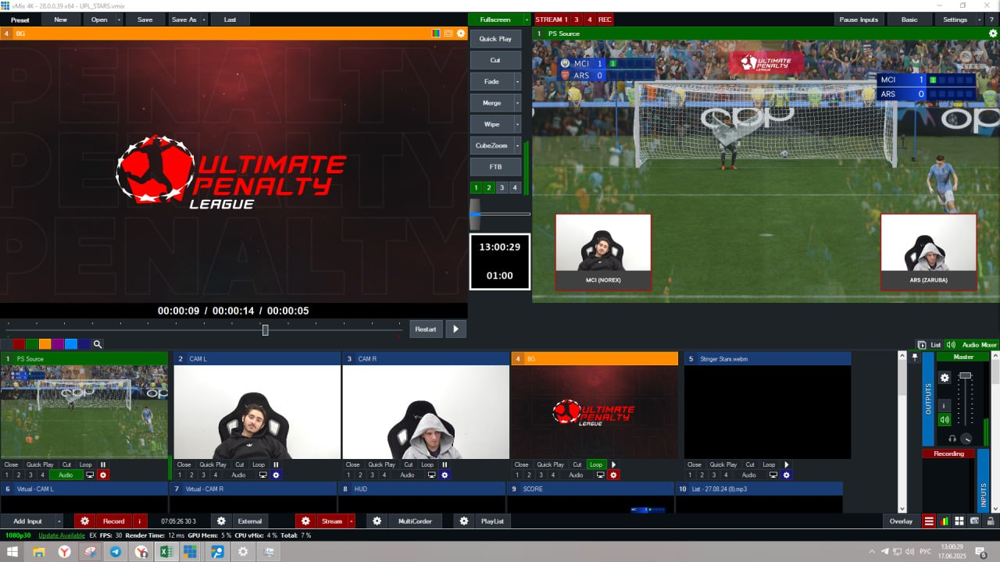
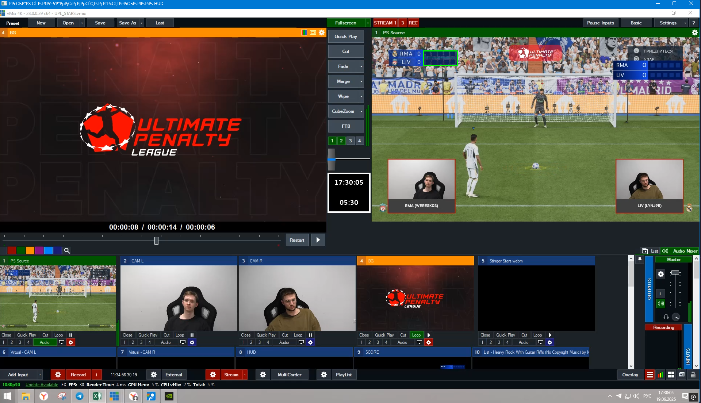

# Общий алгоритм работы

При инициализации приложение пытается достать конфигурацию (config.json) в папке с приложением (.exe файлом в случае сборки).
Если файла конфигурации нет, то создается новый. Подробнее про конфигурацию можно почитать в разделе [Конфигурация](configuration.md).

Затем, если выбран какой-то .xlsx файл для экспорта туда результатов, то становится доступна кнопка "Начать серию матчей"
Поля в интерфейсе:
- Файл с таблицей. Тут понятно все, это файл, в который будет записываться результат по ходу матча. Все, что нам важно в этой таблице - это чтобы была структура типа

| HOMEAWAY    | TEAM | SCORE | PEN1 | PEN2 | PEN3 | PEN4 | PEN5 |
|-------------|-| --- | --- | --- | --- | --- | --- |
| JUV (Ka4abin) |
| MIL (MONK)  |

Все остальное подставится в таблицу само, основываясь на HOMEAWAY и текущем номере матча. в SCORE должна быть формула типа
``=ЕСЛИ(D2="+";1;0)+ЕСЛИ(E2="+";1;0) + ЕСЛИ(F2="+";1;0) + ЕСЛИ(G2="+";1;0) + ЕСЛИ(H2="+";1;0)``

Это нужно, чтобы в случае, если что-то пойдет не так, то режиссер смог бы остановить работу программы и заносить данные в таблицу вручную.

- Также пользователь перед началом работы может выбрать окно с vMix - туда будут отправляться нажатия кнопки Q, чтобы поставить таймер на 15 секунд;
- Монитор. Это должен быть монитор, на котором запущено во весь экран окно с vMix. Пример такого окна ниже. Очень важно, что окно с игрой должно быть справа сверху, а также разрешение должно быть 1920х1080. На данный момент корректная работа гарантируется только на этом разрешении, в иных случаях может работать нестабильно. Пример такого окна можно видеть 

При этом в случае проблем с распознаванием можно нажать на кнопку "Проверить экран", в таком случае откроется экран, который был выбран и область, в которой приложение ожидает увидеть игровой HUD, будет выделена зеленым цветом. На скриншоте идеальное расположение - вокруг области с местами результатов пенальти.

- Также иногда возникают форс-мажорные обстоятельства, при которых серия может прерваться (например, отключение света). В таком случае в приложении
предусмотрена возможность выбрать номер первого матча в следующей серии, чтобы места команд были на правильных местах в соответствии с порядковым номером матча, а также
в логах появилось соответствующее сообщение.
- Ну и последнее поле - это сколько всего матчей предполагается в серии. Оно нужно, чтобы приложение автоматически закончило серию по прошествии N матчей.

Итак, когда с настройкой приложения закончили - можно начать серию матчей. В этот момент начинает браться N скриншотов в секунду с того экрана, который был выбран. Если обнаружен новый результат, который еще не был записан в таблицу,
то этот результат записывается и спустя 2 секунды отправляется нажатие на Q в окно с vMix.

Если определено, что после удара матч окончен (ничьей или победой одной из команд), то матч оканчивается и спустя какое-то время начинается ожидание результатов для следующего матча.

Если окончен последний матч серии, то серия завершается и становится доступна кнопка начала новой серии.

Также, в любой момент времени пользователь может открыть историю матчей. Это откроет логи текущего сеанса работы приложения (каждый новый запуск приложения будет приводить к созданию нового файла с логами)
в режиме чтения, то есть не заблокирует запись в логи программой.
