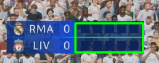
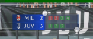

# FAQ

## Приложение плохо распознает результаты или не распознает вообще.
Во первых, убедитесь, что выбранный экран имеет разрешение 1920х1080. В данный момент другие разрешения не поддерживаются для повышенной стабильности работы на этом разрешении.

Во вторых, проверьте, что vMix открыт во весь экран и HUD находится в корректном месте. Для этого в приложении нажмите кнопку "Проверить экран" и убедитесь, что зеленым цветом обведен HUD (в идеале рамка должна быть ровно по периметру областей с результатами пенальти).

В третьих, убедитесь, что HUD, который вы отслеживаете темно-синего цвета. Корректная работа автоопределения на интерфейсах других цветов не гарантируется. **Особенно критично для HUD светлых оттенков**

Если ничего из вышеперечисленного не помогло - попробуйте поднять fps в конфигурации, чтобы приложение чаще брало изображение с экрана для анализа и было больше возможностей для определения результата.

## vMix открыт в весь экран, а справа захват игры, но зеленая рамка в проверке экрана выглядит некорректно
Идеальное расположение зеленой рамки выглядит примерно так:



Важно, чтобы была выделена именно область с ударами. Области со счетом или названиями команд не важны.

## Зеленая рамка находится не там, где нужно. Как я могу изменить ее местоположение?
Это можно сделать самостоятельно поменяв значение ``hudCoords`` в ``config.json``.
Чтобы понять что именно нам нужно поставить делаем следующее:
1) Открываем этот [сайт](https://www.image-map.net).
2) Делаем скриншот всего экрана, который нам нужен (``Alt+Print Screen``)
3) Далее сохраняем его куда-нибудь в виде файла
4) Нажимаем на "Select Image from My PC"
5) Выбираем наш файл
>Очень важно, чтобы наше изображение было именно 1920х1080. Приближать, отдалять нельзя.
6) Выбираем нужную нам область, кликая на точки и двигая их.



7) Нажимаем кнопку "Show me the code!"

В появившемся окне нас интересует
```html
<map name="image-map">
    <area target="" alt="" title="" href="" coords="1164,109,1256,156" shape="rect">
</map>
```
У вас скорее всего будут другие цифры в ``coords``, но это не сильно важно. Это наши координаты, которые нам надо будет вставить в конфиг в таком порядке ``[x1,y1,x2,y2]``.
>Порядок может меняться, например, у вас будет ``[x2,y2,x1,y1]``. Это зависит от того, какие значения больше, а какие меньше. Так ``x1,y1`` должны быть всегда меньше, чем ``x2,y2`` и если бы у меня были ``coords="1256,156,1164,109"``, то ``x1,y1`` были бы в конце этого списка, а не в начале.

В моем случае получается, что я должен в конфиге указать следующее заместо старых значений ``hudCoords``:
```json
  "hudCoords": [
    {
        "x": 1164,
        "y": 109
    },
    {
        "x": 1256,
        "y": 156
    }
  ]
```
После этого перезапускаем приложение и рамка уже должна быть в нужном нам месте.

## Я открыл историю матчей, а она пустая, хотя не так давно были матчи
История внутри приложения сбрасывается при каждом перезапуске, однако её всегда можно найти в папке с исполняемым файлом в папке ``logs``. При каждом запуске программы будет создаваться отдельный файл с логами, который и будет отображаться в текущей истории матчей в приложении.
