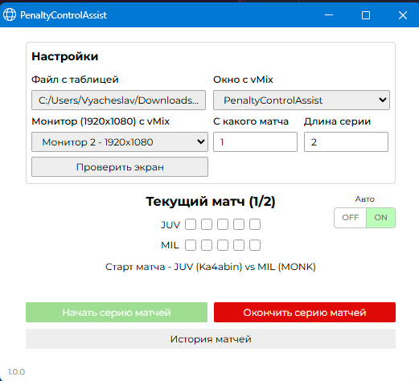

# Обзор проекта

PenaltyControlAssist - это приложение для автоматизации работы режиссеров, использующих vMix при трансляции футбольных матчей с сериями пенальти. Приложение отслеживает результаты ударов на экране, управляет состоянием серии матчей, записывает результаты в Excel-таблицу и отправляет команды в vMix.

## Основные функции:
- Автоматическое отслеживание результатов ударов на экране
- Управление состоянием серии матчей
- Запись результатов в Excel-таблицу
- Логирование результатов
- Автоматическая отправка нажатий клавиш в vMix
- Ручной режим ввода для экстренных ситуаций
